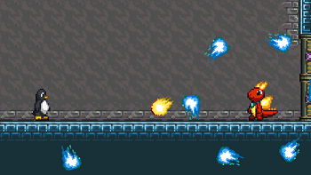
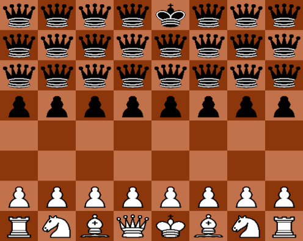
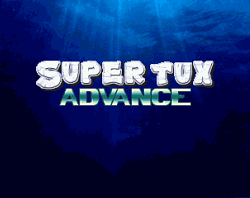
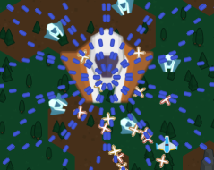

Hello! I'm a software developer making free/open source games on GitHub! 

# Games

### Tux Planet Speedrun Any%

A fangame of SuperTux and SuperTux Advance. Use save states and other powers to win!

Play on [Newgrounds](https://www.newgrounds.com/portal/view/857405) or [itch.io](https://dtsudo.itch.io/tux-planet-speedrun).

Source code: [https://github.com/dtsudo/Tux-Planet-Speedrun-Any-Percent](https://github.com/dtsudo/Tux-Planet-Speedrun-Any-Percent)

### Chess Comp Stomp with Hacks

A game where you use hacks to win against the AI.

Play on [Newgrounds](https://www.newgrounds.com/portal/view/835619) or [itch.io](https://dtsudo.itch.io/chess-comp-stomp-with-hacks).

Source code: [desktop version](https://github.com/dtsudo/Chess-Comp-Stomp-with-Hacks-Desktop-Version) or [browser version](https://github.com/dtsudo/Chess-Comp-Stomp-with-Hacks-Web-Browser-Version)

### SuperTux Advance - web port

I ported KelvinShadewing's [SuperTux Advance](https://github.com/KelvinShadewing/supertux-advance) to run in a web browser.

Play on [itch.io](https://dtsudo.itch.io/supertux-advance-beta-web-version-port).

Source code: [https://github.com/dtsudo/SuperTux-Advance-Web-Port](https://github.com/dtsudo/SuperTux-Advance-Web-Port)

### DT Danmaku 2

A danmaku shmup; play on [itch.io](https://dtsudo.itch.io/dt-danmaku-2) or on [GitHub pages](https://dtsudo.github.io/DT-Danmaku-2-Web-Browser-Version-Demo/DTDanmaku2.html?fps=60&playerbulletspread=1&playerbulletstrength=1&numlives=3).

Source code: [desktop version](https://github.com/dtsudo/DT-Danmaku-2) or [browser version](https://github.com/dtsudo/DT-Danmaku-2-Web-Browser-Version)

### DT Danmaku

A prototype danmaku shmup. Play on [GitHub pages](https://dtsudo.github.io/DT-Danmaku-Web-Browser-Version-Demo/DTDanmaku.html?fps=30).

Source code: [desktop version](https://github.com/dtsudo/DT-Danmaku) or [browser version](https://github.com/dtsudo/DT-Danmaku-Web-Browser-Version)

### DT Sudoku

A simple sudoku game, created as a "hello world" exercise in game development. Play on [GitHub pages](https://dtsudo.github.io/DT-Sudoku-Web-Browser-Version-Demo/DTSudoku.html).

Source code: [desktop version](https://github.com/dtsudo/DT-Sudoku) or [browser version](https://github.com/dtsudo/DT-Sudoku-Web-Browser-Version)

# Other things

### Lichess Bot

I wrote a Lichess bot that intentionally hangs its queen, but then plays Stockfish moves afterwards. (For novice chess players, the bot is still challenging to defeat because novices generally can't win against Stockfish even when up a full queen.)

The codebase is designed as a static site. This means that if you have a Lichess bot account, you can run the bot without installing anything. Just go to https://dtsudo.github.io/Dtsudo-Queen-Sacrifice-Bot/index.html and provide a Lichess OAuth token; the bot will show up on Lichess and accept challenges from other players as long as the browser tab stays open.

Source code: https://github.com/dtsudo/Dtsudo-Queen-Sacrifice-Bot

### Halite AI

[Halite](https://github.com/HaliteChallenge/Halite) was a programming competition held in 2016.

I made an [AI program](https://github.com/dtsudo/HaliteAI) that [ranked 355](https://2016.halite.io/user.html?userID=3326).

I ended up spending more time teaching the AI to write [GG](https://2016.halite.io/game.html?replay=ar1487294118-2779129654.hlt) than actually making it stronger.
